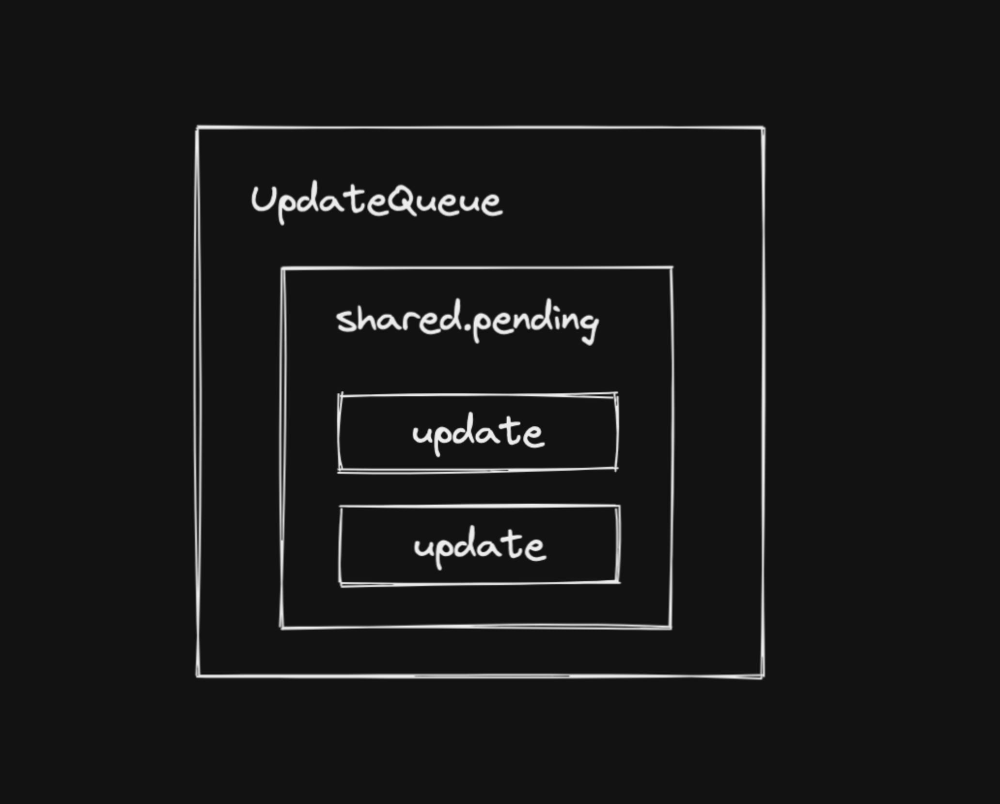

## 常见的触发更新的方式：

* ReactDOM.createRoot().render（或老版的ReactDOM.render）
* this.setState
* useState的dispatch方法

## 我们希望实现一套统一的更新机制，他的特点是：

* 兼容上述触发更新的方式
* 方便后续扩展（优先级机制...）

## 更新机制的组成部分

* 代表更新的数据结构 —— Update
* 消费update的数据结构 —— UpdateQueue

